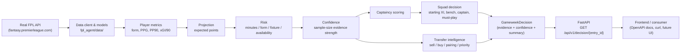

# Fantasy Decision Intelligence

A deterministic Fantasy Premier League (FPL) decision engine, served over a
FastAPI HTTP boundary, that turns a manager's real squad into a fully
evidence-backed gameweek action plan: starting XI, captaincy, and ranked
sell/buy transfer recommendations.

## What it does

Give it an FPL entry ID and a gameweek, and it answers:

1. Who should I start?
2. Who should I bench?
3. Who should I captain?
4. Who should I sell?
5. Who should I buy?
6. What should I do this gameweek, overall?

Every answer is a deterministic function of real FPL data - projected
points, fixture difficulty, form, risk, and confidence - never a guess,
and every recommendation carries structured evidence explaining why.

## Why it exists

Most "FPL AI" tools either hardcode opinions or hand the whole decision to
an LLM and hope the numbers come out sensible. This project takes the
opposite position: **the deterministic engine is the sole decision
authority.** Starting XI, captaincy, bench order, sell candidates, buy
candidates, and transfer priority are all computed by transparent,
testable, reproducible rules over real data. There is no LLM anywhere in
that path - a language model could only ever be added later to narrate an
already-computed decision in prose, never to change it.

That distinction is the point of the project: it is a decision-*engine*,
not a chatbot with FPL opinions.

## Architecture



Four concepts stay deliberately separate through this pipeline, rather
than being collapsed into one score:

| Concept | Question it answers | Where |
|---|---|---|
| **Projection** | What output do we expect? | `analysis/projections.py` |
| **Risk** | How reliable/available is that output? | `analysis/risk_signals.py` |
| **Confidence** | How much evidence backs this player's numbers? | `analysis/confidence.py` |
| **Decision** | What should the manager actually do? | `decisions/` |

## Deterministic decision engine

- **Starting XI / bench**: `decisions/squad_analysis.py` runs a bounded
  formation search (valid GK/DEF/MID/FWD combinations, 3-per-team limit)
  **only over the manager's own 15 supplied picks** - never over the full
  ~650-player pool. This was a deliberate performance fix: an earlier
  version accidentally combinatorially searched the whole player pool and
  became unusably slow. It now completes in milliseconds.
- **Captaincy**: ranked by `captaincy_score` (projection + form + fixture
  ease), captain and vice-captain are the top two, tie-broken by expected
  points then overall selection quality.
- **Must-play**: players with zero availability risk, low overall risk,
  and adequate sample confidence - the players the engine is confident
  enough to flag as auto-starts.
- **Selection score** (used for starting XI/bench ranking and as the
  buy-candidate ranking metric):

  ```text
  confidence_bonus = (sample_confidence - 0.5) * 0.5
  selection_score  = expected_points + form * 0.15 + confidence_bonus
                      - overall_risk * 2.0
  ```

## Transfer intelligence

- **Sell scoring** (`analysis/sell_scoring.py`): every current squad
  player gets a transparent, additive `SellScore` - five independent
  penalties (risk, poor projection, difficult fixture, availability,
  low confidence) that add up to the total, so the score is always
  explainable in terms of the metrics that produced it.
- **Buy candidates** (`decisions/transfer_analysis.py`): the wider player
  pool is filtered cheaply (available, squad-excluded, at least one full
  match's worth of minutes played) before scoring - an `O(n)` pass with
  no combinatorial search - then ranked by the same `selection_score`
  used for squad selection, so buy quality is judged on the identical
  yardstick as your own players.
- **Sell → buy pairing**: each sell candidate is matched to the best
  same-position buy target that would not push any FPL team above three
  players in the resulting squad, with buy targets deduplicated across
  pairs and tiny-improvement pairs dropped rather than padding the list.
- **Transfer priority**: `essential` / `strong` / `optional` / `avoid`,
  classified deterministically from projected gain and whether the move
  replaces a doubtful/unavailable player with a fully available one.
  `avoid`-classified pairs are filtered out of the response entirely -
  the goal is decision usefulness, not a long list.

## Risk vs. confidence vs. availability

These are computed independently and never collapsed into one number:

- **Risk** (`overall_risk`, `risk_level`): a weighted blend of minutes
  risk, form uncertainty, fixture risk, and availability risk.
- **Confidence** (`sample_confidence`): how much playing-time evidence
  backs a player's numbers - independent of whether they're currently
  injured or doubtful.
- **Availability** (`availability_risk`): derived from FPL's own status
  and chance-of-playing fields (injured/suspended/doubtful), folded into
  `overall_risk` as one clearly-labeled component rather than merged
  into it silently.

## API

```
GET /api/v1/decision/{entry_id}?gameweek={gameweek}
GET /health
```

`gameweek` is optional and defaults to the current (or next) FPL
gameweek. The route is a thin HTTP boundary - it only calls
`FPLDecisionService.analyze_gameweek(...)` and converts the result to the
response schema; it contains no decision logic of its own. Invalid
entry IDs, invalid gameweeks, and service-level failures (e.g. an
unresolvable gameweek) map to clean `422`/`400` responses; nothing
raises an unhandled 500 for ordinary bad input.

Interactive OpenAPI docs are available at `/docs` once the server is
running.

### Example response (trimmed)

```json
{
  "gameweek": 3,
  "decision_engine_version": "v1",
  "data_source": "official-fpl-api",
  "confidence": "Low",
  "captain": { "player_id": 599, "web_name": "Cherki", "expected_points": 10.31 },
  "vice_captain": { "web_name": "Haaland" },
  "starting_xi": ["... 11 players ..."],
  "bench": ["... up to 4 players ..."],
  "must_play": [],
  "sell_candidates": [
    {
      "web_name": "Coppola",
      "score": 6.4,
      "rank": 1,
      "reasons": ["Weak projected output (0.0 expected points)", "High overall risk (medium, 0.6)"]
    }
  ],
  "buy_candidates": [
    { "web_name": "Gakpo", "selection_score": 10.2, "price": 7.1 }
  ],
  "transfer_recommendations": [
    {
      "sell": { "web_name": "Coppola" },
      "buy": { "web_name": "Gvardiol" },
      "net_improvement": 9.13,
      "priority": "essential",
      "within_budget": false,
      "reasons": ["Higher expected points (... vs ...)", "Lower risk"]
    }
  ],
  "transfer_count": 5,
  "decision_summary": "Captain: Cherki (10.31 expected points). Vice-captain: Haaland. 5 transfer recommendation(s): ... Decision confidence: Low."
}
```

This is real output from the live API for a public FPL entry (see
Testing below) - it is not fabricated. Field names above are trimmed for
readability; the actual schema exposes richer per-player detail (form,
fixture difficulty, points-per-90, xGI/90, risk breakdown, etc.) without
leaking internal-only fields like the raw selection-score components.

## Testing

```
.venv/Scripts/python.exe -m pytest -q
```

215+ tests, all deterministic and offline - no test in the default suite
calls the live FPL API. Coverage includes:

- Scoring unit tests: sell scoring, buy/transfer scoring, captaincy
  scoring, risk signals, confidence, projections, form trends.
- Decision-engine tests: starting XI formation/team-limit constraints,
  bench selection, must-play, captain/vice-captain selection.
- Transfer-intelligence tests: sell ranking, buy ranking and limits,
  priority-threshold classification, team-limit enforcement during
  pairing, buy-candidate dedup across pairs, tiny-improvement filtering,
  budget-awareness, and the tiny-minute-sample exclusion (see
  Limitations).
- API tests: valid requests, entry_id/gameweek propagation, `ValueError`
  → `400` mapping, request validation → `422`, response-schema shape
  (internal fields never leak), and dependency-injection wiring - all
  against a `FakeDecisionService` via FastAPI `TestClient`, never the
  live API.
- A manual, skipped-by-default live smoke test
  (`tests/test_live_fpl_smoke.py`) exercises the full pipeline against a
  real FPL entry:

  ```
  RUN_LIVE_FPL_SMOKE=1 .venv/Scripts/python.exe -m pytest tests/test_live_fpl_smoke.py -v
  ```

## Running locally

```bash
# 1. Create and activate a virtual environment (Python 3.12+)
python -m venv .venv
.venv/Scripts/activate          # Windows
# source .venv/bin/activate     # macOS/Linux

# 2. Install the project with dev dependencies
pip install -e ".[dev]"

# 3. Run the tests
.venv/Scripts/python.exe -m pytest -q

# 4. Start the API
.venv/Scripts/python.exe -m uvicorn app.main:app --reload

# 5. Try the primary demo endpoint
curl "http://127.0.0.1:8000/api/v1/decision/8731757"
```

No API key is required for the deterministic decision engine or the
FastAPI boundary - the FPL API used is public. `8731757` above is only a
real public FPL entry used for demos; it is never hardcoded into
production decision logic.

## Design principles

1. **The deterministic engine is the sole decision authority.** No LLM
   ever decides starting XI, captaincy, bench, sell/buy candidates, risk,
   or confidence.
2. **Never optimize over the full player pool.** Starting XI search is
   bounded to the manager's own 15 picks; buy-candidate ranking over the
   wider pool is a single `O(n)` scoring pass, never a combinatorial
   search.
3. **Every recommendation carries evidence.** Reasons are generated
   dynamically from the metrics that produced a score - never hardcoded
   per player.
4. **Risk, confidence, and availability are separate concepts.** They are
   computed independently and exposed as distinct fields, not merged into
   one opaque number.
5. **Prefer one strong endpoint over endpoint sprawl.** The whole
   gameweek decision - squad and transfers - is served from a single
   `GET /api/v1/decision/{entry_id}` call.

## Known limitations

- **Early-season / low-minute samples**: per-90 stats extrapolate raw
  minutes with no floor (`total_points / minutes * 90`), so a player with
  only a handful of minutes can produce an inflated projection. The
  buy-candidate pool guards against this by requiring at least one full
  match's worth of minutes before a player is considered a buy candidate
  (see `transfer_analysis._MIN_POOL_MINUTES`), but the same caveat can
  still apply to a manager's own squad members with minimal minutes very
  early in a season - this is a transparent trade-off, not a hidden one.
- **Budget awareness is informational, not enforced**: the manager's
  bank balance is read from FPL's `entry_history.bank` field when
  present and used to flag `within_budget` on each transfer pair, but it
  does not block a recommendation. FPL's public API does not reliably
  expose enough state (pending transfers already made this gameweek,
  free-transfer count, etc.) to enforce a hard budget constraint with
  confidence, so this is surfaced as evidence for the manager to weigh
  rather than a filter.
- **Minutes-risk thresholds are intentionally coarse** and unchanged from
  the original, already-validated model - they were reviewed but not
  altered without a demonstrated bug, per this project's own
  "don't rewrite working code without a reason" principle.

## Future: LLM explanation layer

Deliberately **not** implemented yet, to ship the deterministic core
today rather than risk scope creep. If added later, the architecture is
fixed in advance:

```
Deterministic Engine → Structured Decision → LLM Explanation → Human-readable text
```

Never the reverse. An explanation layer would receive the already-computed
`GameweekDecision` (and nothing else) and could only phrase it in prose -
it would have no ability to invent metrics, change a ranking, or override
a captain/transfer/starting-XI decision made upstream.
